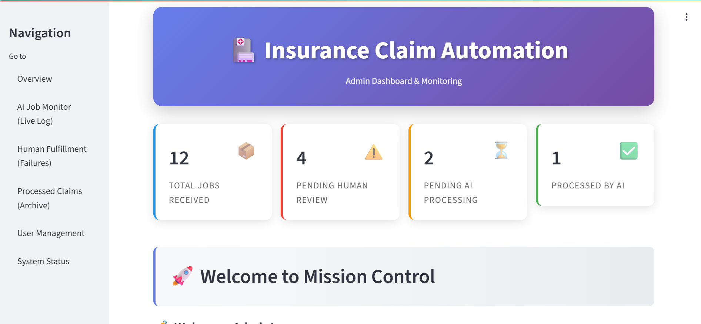
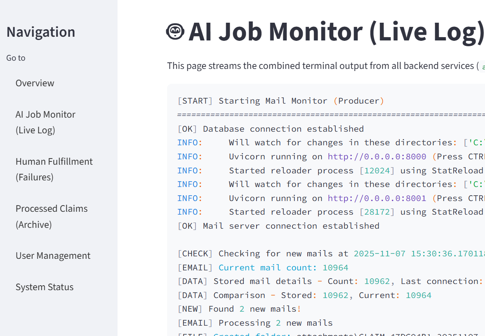
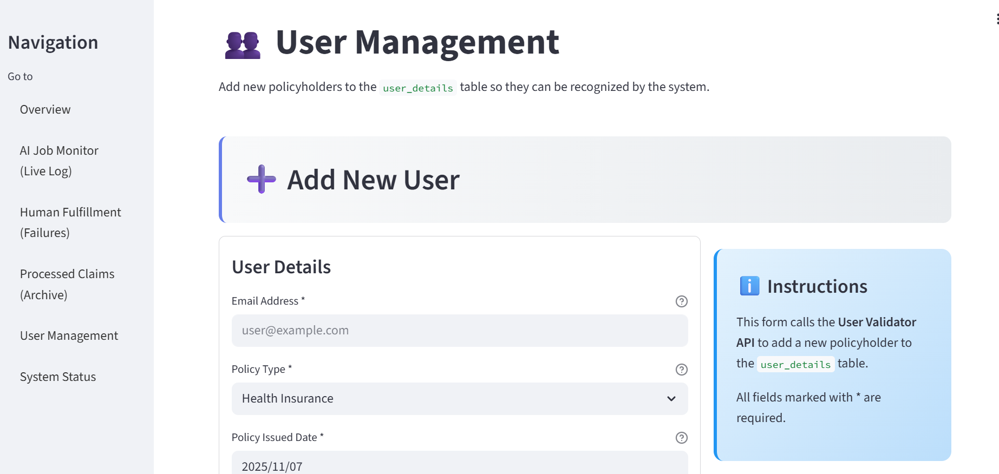
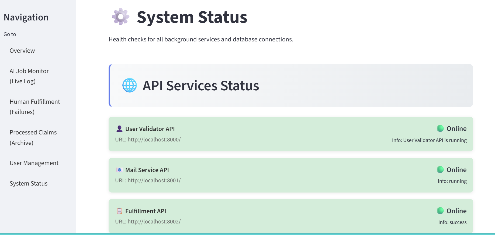

# AI Claim Screener


This project provides a complete, end-to-end solution for automating the initial screening and requirement processing of new insurance claims. The primary goal is to **remove slow, expensive, and error-prone manual work** from the first stage of fulfillment by using a resilient, AI-powered system.

When a customer submits a new claim via email, this system automatically ingests, validates, analyzes, and processes it, only escalating to a human when an unexpected error occurs.

---

## 1. Features & Dashboard

This project is monitored and managed via a "Mission Control" Streamlit dashboard.


| Overview | AI Job Monitor (Live Log) |
| :---: | :---: |
| The main KPI dashboard. | A live stream of the backend terminal logs. |
|  |  |

| Human Fulfillment (Failures) | User Management |
| :---: | :---: |
| A queue to review and manage all failed jobs. | A form to add new, recognized policyholders. |
|  |  |

| System Status |
| :---: |
| A health-check page for all APIs and services. |
|  |

---

## 2. Tech Stack

| Category | Technology | Purpose |
| :--- | :--- | :--- |
| **Python Frameworks** | **Streamlit** | Admin Dashboard (Frontend) |
| | **FastAPI** | Creating microservices (APIs) |
| **Database** | **MySQL** | Main data storage & job queue |
| **AI / LLM** | **AWS Bedrock** | Claim analysis, vision, decision making |
| | **LangChain** | Interacting with the Bedrock LLM |
| **File Storage** | **AWS S3** | Permanent, scalable storage for attachments |
| **Python Libraries** | **uv** | High-performance package management |
| | **uvicorn** | ASGI server for running FastAPI |
| | **requests** | HTTP client for inter-service communication |
| | **boto3** | AWS SDK for Bedrock and S3 |

---

## 3. System Architecture

This project is built on a **resilient, producer-consumer architecture** using a database as the job queue. This decouples the "ingestion" of emails from the "processing" of claims.

* **Producer (`mail_monitor.py`):** Checks for new emails and adds them as `PENDING` jobs to the `mail_jobs` table.
* **Consumer (`worker.py`):** Fetches `PENDING` jobs, performs all processing, and updates the job status.
* **Safety Nets:** `stuck_job_resolver.py` and the `human_fulfillment` table catch all errors.


## 4\. Folder Structure

```
/your-project-directory
├── apis/
│   ├── user_validator.py     # FastAPI: Manages user_details table
│   ├── mail_service.py       # FastAPI: Sends email via SMTP
│   └── fulfillment_api.py    # FastAPI: Manages fulfillment table
│
├── docs/
│   └── screenshots/          # Add your screenshots here
│       ├── overview.jpg
│       ├── live-log.png
│       ├── failures.png
│       ├── user-management.jpg
│       └── system-status.png
│
├── .venv/                      # Your virtual environment
├── attachments/                # Temp storage for downloaded attachments
├── main_runner.py              # Runs all 6 backend services
├── mail_monitor.py             # Producer: Checks for new mail
├── worker.py                   # Consumer: Processes jobs
├── stuck_job_resolver.py       # Safety Net: Fixes stuck jobs
├── fulfillment_processor.py    # Helper class (LLM, S3 logic)
├── s3_uploader.py              # Helper class (S3 logic)
├── streamlit_app.py            # Admin Dashboard (Frontend)
├── requirements.txt            # Python dependencies
├── app.log                     # Live log file (created by main_runner.py)
├── .env                        # Your local environment variables
└── README.md                   # This file
```

-----

## 5\. Setup & Installation

### Step 1: Clone the Repository

```bash
git clone <your-repo-url>
cd <your-project-directory>
```

### Step 2: Environment & Dependencies (using `uv`)

This project uses `uv` for fast Python package management.

1.  **Install `uv`** (if you don't have it):
    ```bash
    pip install uv
    ```
2.  **Create a virtual environment:**
    ```bash
    uv venv
    ```
3.  **Activate the environment:**
    *On Windows (PowerShell):*
    ```powershell
    .venv\Scripts\Activate.ps1
    ```
    *On Windows (cmd.exe):*
    ```bash
    .venv\Scripts\activate
    ```
    *On macOS/Linux:*
    ```bash
    source .venv/bin/activate
    ```
4.  **Sync the dependencies:**
    This command reads `requirements.txt` and installs all necessary packages.
    ```bash
    uv sync
    ```

### Step 3: Set Up the Database

You must create the following 5 tables in your MySQL database.

\<details\>
\<summary\>Click to view Database Schema SQL\</summary\>

```sql
-- -----------------------------------------------------
-- Table `user_details`
-- Stores registered policyholders
-- -----------------------------------------------------
CREATE TABLE IF NOT EXISTS `user_details` (
  `id` INT NOT NULL AUTO_INCREMENT PRIMARY KEY,
  `mail_id` VARCHAR(255) NOT NULL UNIQUE,
  `policy_type` VARCHAR(255) NOT NULL,
  `policy_issued_date` DATE NOT NULL
);

-- -----------------------------------------------------
-- Table `last_mail_details`
-- Tracks the last email checked by the mail monitor
-- -----------------------------------------------------
CREATE TABLE IF NOT EXISTS `last_mail_details` (
  `id` INT NOT NULL AUTO_INCREMENT PRIMARY KEY,
  `mail_count` INT NOT NULL,
  `last_connection_time` DATETIME NOT NULL
);

-- -----------------------------------------------------
-- Table `mail_jobs`
-- This is the main job queue for the worker
-- -----------------------------------------------------
CREATE TABLE IF NOT EXISTS `mail_jobs` (
  `id` INT NOT NULL AUTO_INCREMENT,
  `claim_id` VARCHAR(100) NOT NULL,
  `sender_email` VARCHAR(255) NOT NULL,
  `subject` TEXT NULL,
  `content` LONGTEXT NULL,
  `local_attachment_paths` JSON NULL,
  `status` VARCHAR(45) NOT NULL DEFAULT 'PENDING',
  `error_message` TEXT NULL,
  `created_at` DATETIME NOT NULL DEFAULT CURRENT_TIMESTAMP,
  `last_processed_at` DATETIME NULL,
  PRIMARY KEY (`id`),
  INDEX `idx_status_last_processed_at` (`status` ASC, `last_processed_at` ASC) VISIBLE
)
ENGINE = InnoDB;

-- -----------------------------------------------------
-- Table `human_fulfillment`
-- The "safety net" table for failed jobs
-- -----------------------------------------------------
CREATE TABLE IF NOT EXISTS `human_fulfillment` (
  `id` INT NOT NULL AUTO_INCREMENT,
  `failed_job_id` INT NOT NULL,
  `claim_id` VARCHAR(100) NOT NULL,
  `sender_email` VARCHAR(255) NULL,
  `error_message` TEXT NULL,
  `full_job_data` JSON NULL,
  `status` VARCHAR(45) NOT NULL DEFAULT 'NEEDS_REVIEW',
  `created_at` DATETIME NOT NULL DEFAULT CURRENT_TIMESTAMP,
  PRIMARY KEY (`id`),
  INDEX `fk_human_fulfillment_mail_jobs_idx` (`failed_job_id` ASC) VISIBLE,
  CONSTRAINT `fk_human_fulfillment_mail_jobs`
    FOREIGN KEY (`failed_job_id`)
    REFERENCES `mail_jobs` (`id`)
    ON DELETE NO ACTION
    ON UPDATE NO ACTION
)
ENGINE = InnoDB;

-- -----------------------------------------------------
-- Table `fulfillment`
-- The final destination for successfully processed claims
-- -----------------------------------------------------
CREATE TABLE IF NOT EXISTS `fulfillment` (
  `fulfillment_id` VARCHAR(50) PRIMARY KEY,
  `user_mail` VARCHAR(255) NOT NULL,
  `claim_id` VARCHAR(255),
  `mail_content` TEXT,
  `mail_content_s3_url` VARCHAR(1024) NULL,
  `attachment_count` INT DEFAULT 0,
  `attachment_s3_urls` JSON NULL,
  `local_attachment_paths` JSON NULL,
  `fulfillment_status` VARCHAR(50) NOT NULL,
  `missing_items` TEXT NULL,
  `s3_upload_timestamp` DATETIME NULL,
  `created_at` DATETIME NOT NULL
);
```

\</details\>

### Step 4: Configure Environment Variables

Create a file named `.env` in the root folder and add your credentials.

```ini
# --- Email Account (for IMAP & SMTP) ---
# This is the account that will check for mail and send replies
EMAIL_USERNAME=your-email@gmail.com
EMAIL_APP_PASSWORD=your-google-app-password

# --- MySQL Database ---
mysql_host=localhost
mysql_user=root
mysql_password=your_db_password
mysql_db=your_db_name
mysql_port=3306

# --- AWS Bedrock (LLM) ---
AWS_REGION=us-east-1
BEDROCK_API=your_bedrock_api_key
BEDROCK_MODEL_ID=model id
BEDROCK_TEMPERATURE=0.3
BEDROCK_MAX_TOKENS=1500

# --- AWS S3 (Storage) ---
# Credentials must be provided at runtime or via environment variables
# AWS_ACCESS_KEY_ID=
# AWS_SECRET_ACCESS_KEY=
S3_BUCKET_NAME=your-s3-bucket-name

# --- Local File Storage ---
LOCAL_ATTACHMENTS_FOLDER=attachments

# --- Notification Emails ---
APPROVAL_EMAIL=admin-team@yourcompany.com
HUMAN_VERIFICATION_EMAIL_ID=tech-support-team@yourcompany.com
```

## 6\. Running the Application

This application runs in **two separate terminals**.

### Terminal 1: Run the Backend Services

This command starts all 6 backend processes (3 APIs, 3 Workers) and logs their combined output to `app.log`.

```bash
# Make sure your virtual environment is active
# (.venv/Scripts/activate)

python main_runner.py
```

Leave this terminal running. It is your entire backend.

### Terminal 2: Run the Admin Dashboard

This command starts the Streamlit web server for your dashboard.

```bash
# Make sure your virtual environment is active
# (.venv/Scripts/activate)

streamlit run streamlit_app.py
```

Streamlit will automatically open your web browser to the dashboard (e.g., `http://localhost:8501`).

```
